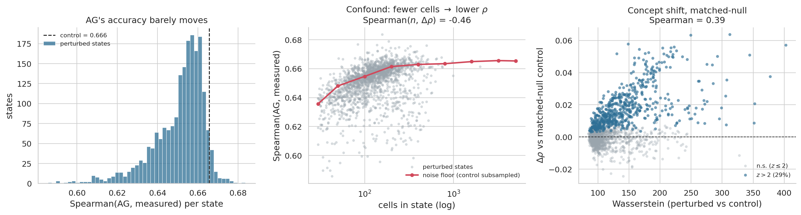

# IICD_2026_Group_Project

Concept-shift analysis of latent spaces learned from foundation models, and how they
translate across cell state — the Replogle 2022 K562-essential CRISPRi screen crossed
with a **state-blind AlphaGenome baseline**.

## The one principle

AlphaGenome predicts expression from **DNA sequence only**. A knockdown does not change
any downstream gene's sequence, so AlphaGenome makes the **same prediction in every cell
state**. We therefore run it **once per gene** (8,545 genes with valid hg38 coords), cache
it, and reuse it across all 1,971 perturbed states.

> There are no per-(perturbation, gene) AlphaGenome calls anywhere in this repo.

## The question, and how we measure it

**Does AlphaGenome's accuracy degrade as the cell state shifts away from control?**

For each perturbed state `P`, over a gene set that excludes `P`'s own perturbed gene
(and, optionally, its ±2 Mb cis neighbours):

```
rho_P    = spearman( AG, pseudobulk[P]       )
rho_ctrl = spearman( AG, pseudobulk[control] )   # same genes
d_rho    = rho_ctrl - rho_P                      # AG's accuracy degradation
```

Two design choices do the heavy lifting:

- **Spearman, rolled up per state.** Spearman is monotone-invariant, so AlphaGenome's raw
  signal never has to be calibrated onto the expression scale. That removes a nest of
  artifacts: a least-squares/isotonic calibration fits the *conditional mean* and so
  shrinks (sd 0.39 vs measured 0.50), which makes AG look like it "under-predicts
  high-expressed genes"; and absolute error in log1p space is heteroscedastic, so |error|
  tracks expression level. Neither is a property of AlphaGenome.
- **A matched null for the cell-count confound.** Essential-gene knockdowns kill cells: the
  median state holds ~125 cells against ~10,691 for control. A noisier pseudobulk
  correlates worse with AG *for free* — measured `Spearman(n_cells, d_rho) = -0.46`.
  Correcting to the *median* cell count is not enough, because rho is steeply nonlinear in
  n (0.638 at n=30, 0.666 at n=5000). Instead we subsample the **control cells to each
  state's own cell count**, `n_boot` times, giving the expected rho and its sd — hence a
  z-score per state.

## Results (n = 1,971 states, 8,545 genes)

| | |
|---|---|
| ρ(AG, measured), control | **0.6657** |
| ρ(AG, measured), perturbed | **0.6507** |
| Δρ **raw** | +0.0150 — 95.4% of states "degrade" |
| Δρ **matched-null** | **+0.0050** — 62% degrade, only **29% at z>2** |
| Spearman(Δρ_matched, Wasserstein) | **0.389** (raw 0.450) |

**Two-thirds of the apparent degradation was cell-count noise.** What survives still tracks
perturbation strength (0.389), and it survives *because* `n_cells` barely tracks Wasserstein
(−0.075).

**AlphaGenome's gene-ranking accuracy is almost state-invariant**: a 0.75% relative loss on
a base of 0.666. The concept shift is real and strength-dependent, but small. The
most-degraded states are mechanistically coherent — RNA exosome (`DIS3`, `EXOSC3`, `EXOSC5`),
spliceosome (`SNRPC`), ribosome (`RPL17`, `RPL27`): knock out RNA degradation or translation
machinery and the transcriptome stops looking like its DNA-encoded default.



Which AlphaGenome head? The spec called CAGE primary and RNA-seq "secondary, noisier". The
data says the opposite, and it should — the measured observable is scRNA-seq expression, so
the **gene-body RNA-seq** head is the matched quantity (K562 also has 5 RNA-seq tracks to
average vs 2 CAGE). Within-state Spearman: `rna_pred` **0.666** vs `cage_pred` 0.339.

## Two consumers, one shared data module

This repo produces the AlphaGenome (sequence) side. A parallel effort computes single-cell
foundation model (**scFM**, e.g. scVI) embedding displacements on the same screen. Both sides
must operate on identical filtered cells and pseudobulk, so that lives in one importable,
dependency-light module:

```python
from concept_shift import data
csd = data.prepare(filtered_h5ad="out/replogle_k562_filtered.h5ad")
csd.adata          # 30-cell-filtered, normalised AnnData (all 8,563 genes)
csd.pb, csd.delta  # pseudobulk mean + measured delta vs control
csd.coords         # strand-aware hg38 TSS table
```

> ⚠️ **Do not call `pertpy.dt.replogle_2022_k562_essential()`.** In pertpy 1.0.3 that
> function is bugged — its download URL points at `gasperini_2019_atscale.h5ad`, so it
> silently returns a *different dataset* (207k×13k enhancer screen). `data.load_replogle`
> fetches the canonical scPerturb file directly.

`concept_shift.data` and `concept_shift.state_shift` import **without** torch / AlphaGenome,
so the scFM team installs only the core deps.

## Layout

```
concept_shift/
├── data.py          # ⭐ shared load / filter / pseudobulk / coords (torch-free)
├── state_shift.py   # ⭐ the analysis: gene filters, per-state rho, matched null, plots
├── seq.py           #   hg38 genome fetch + one-hot        (AlphaGenome extra)
└── ag_backbone.py   #   AlphaGenome pytorch-port baseline  (AlphaGenome extra)
scripts/
├── 0_preprocess/prepare_data.py       # download -> filter -> pseudobulk -> coords
├── 1_baseline/run_ag_k562_baseline.py # one AG prediction per gene (GPU, resumable, shardable)
├── 2_wasserstein/run_wasserstein.py   # per-state OT distance = the strength axis
└── 3_analysis/run_state_shift.py      # per-state rho + matched null + plots
metadata/track_metadata.parquet        # K562 AlphaGenome track indices
tests/                                  # pytest (non-GPU, no weights, no network)
examples/                               # run_all.sh + SLURM array templates
```

## Environment (uv)

```bash
uv sync                                        # core (enough for the scFM team)
uv sync --extra alphagenome --extra plotting   # + torch, pysam, tangermeme, alphagenome-pytorch
```

Python ≥3.10 (runs on 3.11). AlphaGenome uses the **pytorch port with local weights**
(`gtca/alphagenome_pytorch`, all-folds) — no API, no rate limits, no key.

## Running

```bash
bash examples/run_all.sh          # or step by step:
python scripts/0_preprocess/prepare_data.py
python scripts/1_baseline/run_ag_k562_baseline.py   # GPU; shard it on a cluster
python scripts/2_wasserstein/run_wasserstein.py
python scripts/3_analysis/run_state_shift.py
```

The 1 Mb baseline is best sharded — see [`examples/slurm_ag_baseline_array.sh`](examples/slurm_ag_baseline_array.sh)
(koolab) and [`..._bioai.sh`](examples/slurm_ag_baseline_array_bioai.sh) (bio_ai, 5 shards ≈ 38 min).

## Gene filtering

**Global** (one gene list for every state), via `state_shift.filter_genes` or the step-3 CLI:

| option | meaning |
|---|---|
| `--expr_threshold t --require_expressed_in_control` | keep genes with control pseudobulk > `t` |
| `--expr_threshold t --min_states_expressed N` | keep genes expressed > `t` in ≥ N states |
| `--min_mean_expr m` | keep genes whose mean pseudobulk across states ≥ `m` |
| `--gene_whitelist f.txt` | restrict to a pathway / regulatory network |

> `--expr_threshold 0` drops **nothing**: this screen's gene set is already
> expression-filtered (no gene is 0 anywhere; min control pseudobulk = 0.022). So
> "expressed in ≥1 state" and "expressed in control" are no-ops without a positive
> threshold. For reference, of 8,545 genes: `>0.05` in control → 8,519; `>0.1` in control →
> 6,875; `>0.01` in all 1,971 states → 6,995.

**Per-state** (a different gene set per perturbation, e.g. the regulatory network of the
perturbed gene) — the gene sets then differ enough that the matched null must be rebuilt per
state, which `compute_state_shift` selects automatically:

```python
from concept_shift import state_shift as ss
res, floor = ss.compute_state_shift(..., per_state_genes={"GATA1": [...], ...})
# res.attrs["null_mode"] == "per_state"
```

On top of either, each state always drops its own perturbed gene (`exclude_target`) and
optionally its cis neighbours (`exclude_cis`) — **per state, not globally**: `GATA1` is
dropped from the `GATA1` row only, and still scored under the other 1,966 states.

## Outputs (`out/`)

| File | Step | Contents |
|---|---|---|
| `replogle_k562_filtered.h5ad` | 0 | 30-cell-filtered, normalised AnnData (shared with scFM) |
| `pseudobulk.parquet`, `delta.parquet` | 0 | per-state mean + measured delta |
| `knockdown_check.csv` | 0 | soft percent-of-control QC flag (never drops) |
| `coords.parquet` | 0 | strand-aware hg38 TSS table |
| `ag_k562_baseline.parquet` | 1 | RNA-seq gene-body (primary) + CAGE TSS (secondary) per gene |
| `wasserstein_distance.parquet` | 2 | per-state OT distance vs control |
| `ag_state_shift.parquet` | 3 | per-state `rho_ctrl, rho_pert, d_rho, rho_null_*, d_rho_matched, z` |
| `rho_noise_floor.parquet` | 3 | rho vs #cells curve (the confound) |

## Tests

```bash
uv run pytest
```

Non-GPU, no weights, no network. Covers normalisation detection, the 30-cell filter,
pseudobulk/delta, percent-based knockdown QC, strand-aware coordinates, AlphaGenome track
selection / gene-body geometry, and — for the analysis — gene filtering, per-state (not
global) target/cis exclusion, per-state gene sets, Spearman edge cases, and that the matched
null reproduces the "more cells → higher rho" confound.

## License

MIT.
